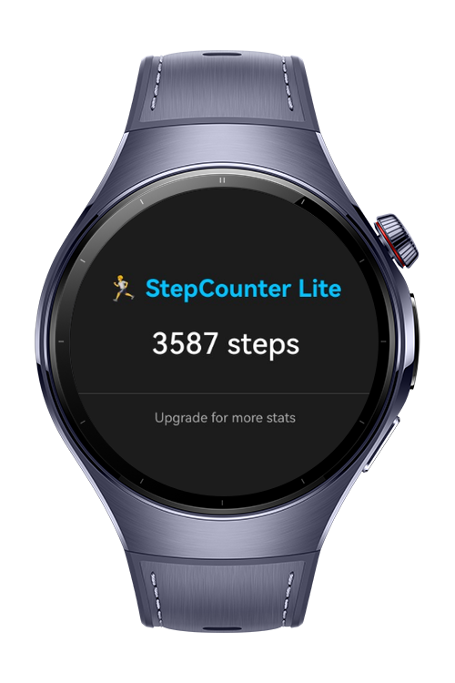

> **Note:** To access all shared projects, get information about environment setup, and view other guides, please visit [Explore-In-HMOS-Wearable Index](https://github.com/Explore-In-HMOS-Wearable/hmos-index).

# How to implement product-based build variants

This application shows how to implement product-based build variants (`free` and `paid`) using the `build-profile.json5` file. The app displays a basic step counter on a wearable device. Depending on the build variant, extra information such as **calorie estimation** and a **premium badge** are conditionally shown.

# Preview

<div>


</div>

# Use Cases
Main page for displaying the user's step count.
- In the **free** product, only the step count is shown.
- In the **paid** product, the app shows additional info:
  - Calorie estimation
  - Premium user badge
  - Themed header text

# Tech Stack

- **Languages**: ArkTS, ArkUI
- **Frameworks**: HarmonyOS SDK 5.1.0(18)
- **Tools**: DevEco Studio Vers 5.1.0.820
- **Libraries**: @kit.ArkUI


# Directory Structure
```
|---entryability
| |---EntryAbility.ets
|---entrybackupability
| |---EntryBackupAbility.ets
|---pages
| |---Index.ets
```

# Constraints and Restrictions
## Supported Device
- Huawei Watch 5

## Before 
- Before building, **Build Mode** must be selected as free or paid.

## Build Variant Configuration (build-profile.json5)

```json5
"buildModeSet": [
  {
    "name": "free",
    "buildOption": {
      "arkOptions": {
        "buildProfileFields": {
          "IS_PREMIUM": "false"
        }
      }
    }
  },
  {
    "name": "paid",
    "buildOption": {
      "arkOptions": {
        "buildProfileFields": {
          "IS_PREMIUM": "true"
        }
      }
    }
  }
]
```

# LICENSE
**Build Variant** is distributed under the terms of the MIT License.
See the [license](/LICENSE) for more information.

